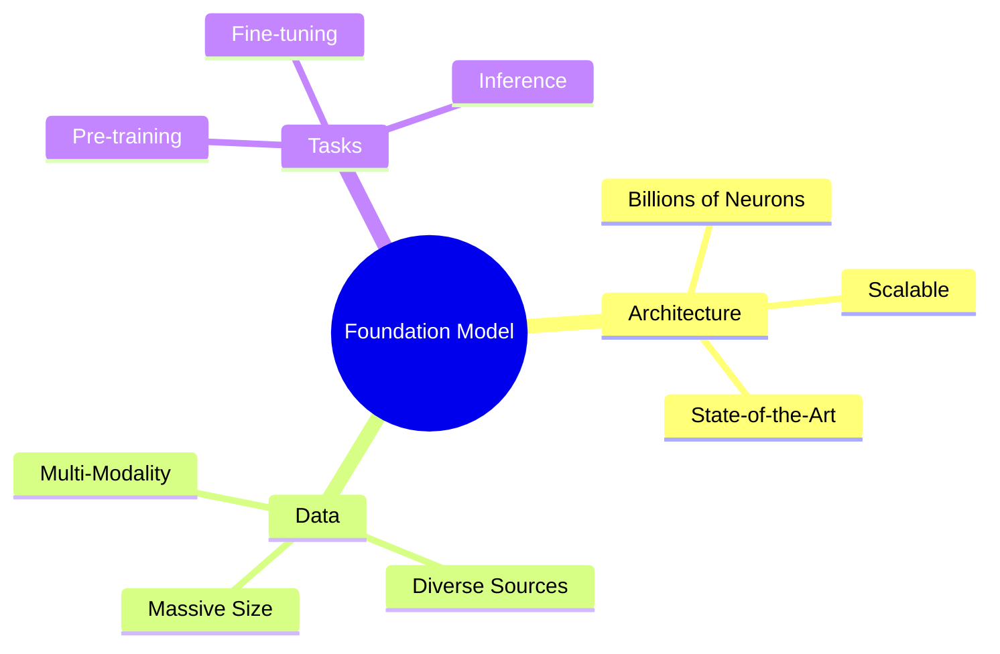
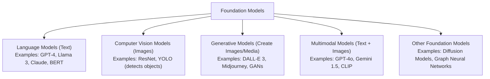
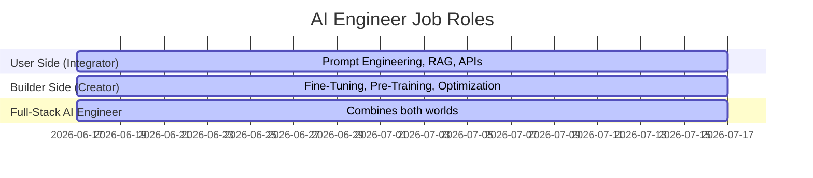

# Generative AI (GenAI): Beginner-Friendly Foundation & Roadmap

Welcome to your learning roadmap for **Generative AI (Gen AI)**! If you are just starting out, AI can feel overwhelming with all its technical terms. This guide is designed to explain everything in **simple, everyday English**, using real-world analogies.

Think of this document as your map to understanding how modern AI brains work, how developers build them, and how you can use them to create awesome tools.

---

## 1. What is a "Foundation Model"?

Before we dive into the details, let's understand the core concept: a **Foundation Model**.

> [!NOTE]
> **What is a Foundation Model?**
> Think of it like a **general-education school graduate**. It has read millions of books, understands grammar, facts, and common sense. It isn't a specialist doctor or lawyer yet, but it has a strong "foundation" and can be trained to do almost anything.

When we build or use a Foundation Model, we look at it from three main angles:



---

## 2. Core Concepts: Architecture, Data, and Tasks

Let's break down the three branches of the Foundation Model.

### A. The Brain: Neural Network Architecture
The "Architecture" is the blueprint of the AI's digital brain.
* **Neurons (Parameters):** Just like your brain has cells (neurons) connected together, an AI has digital switches called **parameters**. Modern models have **billions of parameters**. 
  * *Analogy:* Imagine a giant control panel with 100 billion knobs. Turning these knobs changes how the AI behaves. The more knobs, the smarter the AI can be.
* **Scalable:** The blueprint must be "scalable," meaning it works just as well whether the AI brain is small (millions of parameters) or super massive (trillions of parameters).
* **State of the Art (SOTA):** This simply means using the newest, most advanced, and best-performing designs available in the world today.

### B. The Food: Data
An AI brain is empty until you feed it information. 
* **Massive Data:** Models need to read a huge chunk of the internet (Wikipedia, books, articles, code).
* **Diverse Data:** It shouldn't just read one topic. It needs to read about history, science, coding, stories, and conversations to understand our world.
* **Modality:** This refers to the *type* of data. 
  * **Single-modal:** Reads only text.
  * **Multi-modal:** Can understand text, images, audio, and video all at the same time.

### C. The Goal: Tasks
A foundation model learns general skills that it can transfer to different jobs (**Transfer Learning**).
1. **Pre-Training (General Education):** The model reads massive data to learn basic patterns.
   * *For Language Models:* The general task is **Next-Word Prediction**. The AI plays a game of fill-in-the-blank over and over (e.g., "The cat sat on the [mat]").
   * *For Vision Models:* The general task is **Image Captioning**. The AI looks at an image and tries to describe it in words.
2. **Fine-Tuning (Specialized Training):** Teaching the general model to be an expert assistant (e.g., teaching it to write code, answer customer questions, or translate languages).
3. **Inference (Real World Action):** This is when the model is finished training, and you ask it a question (a prompt) and it gives you an answer (generation).

---

## 3. Under the Hood: The Builder's Perspective

If you want to be a **Builder** (someone who designs or trains these models), you need to understand the **Transformer Architecture**.

### The Transformer: The Engine of GenAI
Invented by Google in 2017, the Transformer is the design that changed everything. It has two main superpowers:
1. **Parallel Processing:** Older AI designs read sentences word-by-word (first "The", then "cat", then "sat"). Transformers can read the *entire* sentence at once. This makes training extremely fast.
2. **Self-Attention:** When reading a word, the AI looks at other words in the sentence to understand its context.
   * *Analogy:* In the sentence *"The animal didn't cross the street because **it** was too tired"*, how do you know what **"it"** refers to? Self-attention allows the model to connect the word **"it"** directly to **"animal"**, not "street".

### The GenAI Landscape
Foundation models are not all the same. They are built for different jobs:



---

## 4. The Life Cycle: Pre-Training, Optimization, & Tuning

How do we actually build and prepare these models for the world?

### Step 1: Pre-Training
During pre-training, the AI learns grammar, facts, and reasoning.
* **Tokenization:** Computers don't understand words. We must chop text into tiny pieces called **tokens** (usually parts of words or syllables) and turn them into numbers.
  * *Example:* The word `"unbelievable"` might be split into `["un", "believ", "able"]`.
* **Training Objectives:** The rules of what the AI is trying to learn (like predicting the next word).
* **Handling Challenges:** When training massive models, computers can crash, run out of memory, or learn things incorrectly. Builders use specialized coding frameworks to handle these issues.

### Step 2: Optimization (Making it Faster and Smaller)
Big models are heavy and expensive to run. Builders use **Model Compression** to make them lightweight:
* **Quantization:** Reducing the detail of the model's math.
  * *Analogy:* Converting a heavy 4K movie into a 1080p video. It still looks great to the human eye, but the file size is much smaller and loads instantly.
* **Pruning:** Deleting the "neurons" or connections that the AI rarely uses.
* **Knowledge Distillation:** Using a giant, smart model (the "Teacher") to train a much smaller model (the "Student") so the student behaves almost as smartly as the teacher.

### Step 3: Fine-Tuning (Specialized Training)
Once the model is pre-trained, we refine it:
* **Task-Specific Fine-Tuning:** Training the model on a small, high-quality dataset for one specific job (like summarizing legal papers).
* **Instruction Tuning:** Training the model to respond like a helpful chatbot. Without this, if you ask *"What is the capital of France?"*, the model might just say *"What is the capital of Germany?"* instead of answering you. Instruction tuning teaches it to follow commands.
* **Continual Pre-training:** Feeding the model new data so its knowledge stays up-to-date.

### Step 4: Evaluation
How do we know if our model is good? We test it on benchmarks (standard tests) to measure things like:
* **Accuracy:** Does it give correct facts?
* **Safety:** Does it refuse to give harmful instructions (like how to hack a computer)?
* **Speed:** How fast does it generate words?

### Step 5: Deployment
Once the model is ready, we "deploy" it. This means uploading the model to a cloud server (like Amazon Web Services or Google Cloud) so that anyone can send requests to it using their phone or computer.

---

## 5. The User's Perspective: Building AI Applications

You don't need to train a model from scratch to build an AI app. Most developers act as **Users** or **Integrators** who build on top of existing models.

### A. Open Source vs. Closed Source
When choosing a model to build with, you have two options:

| Feature | Open Source Models (e.g., Llama 3, Mistral) | Closed Source Models (e.g., GPT-4, Claude 3) |
| :--- | :--- | :--- |
| **What is it?** | The code and weights are free for anyone to download. | Owned by a company; you can only use it via their website or API. |
| **Control** | You have 100% control. You can run it on your own computer. | You have no control over the model itself. |
| **Privacy** | Super high. Your data never leaves your servers. | Lower. Your data is sent to the company running the AI. |
| **Setup Cost** | High. You need expensive hardware (GPUs) to run it. | Very low. You pay a small fee per question asked. |

### B. APIs, Hugging Face, and Ollama
* **LLM APIs:** A simple way to connect your code to closed-source models. You send a text message (API call) to OpenAI, and they send back the AI's response.
* **Hugging Face:** Think of Hugging Face as the **GitHub of AI**. It is a giant website where people share open-source models, datasets, and code.
* **Ollama:** A free tool that lets you run powerful open-source models (like Llama 3) directly on your own laptop with just one simple command.

---

## 6. How to Improve Your AI Application's Output

When you build an app, the AI will sometimes make mistakes, hallucinate (make up facts), or not know about private company files. You can fix this using four techniques:

```
  SIMPLEST ──────────────────────────────────────────────> ADVANCED
  [ Prompt Engineering ] ──> [ RAG ] ──> [ Fine-Tuning ] ──> [ Pre-training ]
```

### 1. Prompt Engineering
This is the art of writing clear instructions to get the best answer. 
* *Tip:* Give the AI a role (e.g., *"Act as a senior python developer"*), give it examples of the output you want, and tell it to think step-by-step.

### 2. Retrieval-Augmented Generation (RAG)
RAG is the most popular way to make an AI smart about your private files.
* *Analogy:* Imagine taking an exam. 
  * Without RAG, it's a **closed-book exam**. The AI has to guess from memory (which leads to lying/hallucinations).
  * With RAG, it's an **open-book exam**. When you ask a question, the system searches your private documents for the right pages, hands those pages to the AI, and says: *"Read these pages and answer the question based only on this facts."*

### 3. LangChain (Application Development Framework)
LangChain is a tool that helps developers connect LLMs to other software tools, databases, and APIs. It allows you to build multi-step chains (e.g., *"Step 1: Ask LLM to summarize email. Step 2: Use Python to draft a reply. Step 3: Send the reply using Gmail"*).

---

## 7. The Future: AI Agents & LLMOps

As you grow in your GenAI journey, you will hear about these advanced topics:

### AI Agents
An Agent is an AI that doesn't just talk—it **does things**.
* *Analogy:* A standard chatbot is like a consultant—you ask it a question, and it gives advice. An AI Agent is like an assistant—you tell it *"Book a flight to Paris under $500 for next Tuesday"*, and it will search the web, compare prices, make a decision, and execute the task autonomously using external tools.

### LLMOps (Large Language Model Operations)
Just like DevOps, LLMOps is the practice of managing AI applications in production. It answers questions like:
* Is our AI app too slow?
* How much money are we spending on API calls?
* Are users getting high-quality answers, or is the model behaving badly?

---

## 8. Career Pathways: What kind of AI Engineer do you want to be?

The job market for AI engineers is growing rapidly. It can be split into three roles:



### 1. User-Side Requirements (The App Builder)
* **What you do:** Build apps using existing models. You don't need to know heavy math.
* **Skills needed:** Python or JavaScript, Prompt Engineering, API integration, LangChain/LlamaIndex, and RAG.

### 2. Builder-Side Requirements (The Model Creator)
* **What you do:** Train models, write new algorithms, and optimize model performance.
* **Skills needed:** Deep learning (PyTorch, TensorFlow), understanding of neural network math, model compression techniques (Quantization), and managing large clusters of GPUs.

### 3. Both User and Builder Side (The Full-Stack AI Engineer)
* **What you do:** You understand how to choose, fine-tune, deploy, and build applications around models. This is highly valued because you bridge the gap between business needs and deep technical research.